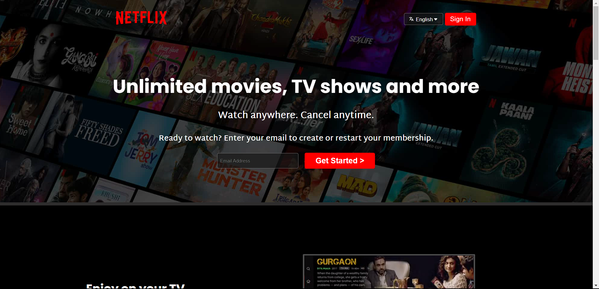

<h1 align="center">Netflix Landing Page UI Clone</h1>
<h3 align="center"> A responsive & interactive Netflix landing page clone doen as a Frontend project </h3>

# Concepts Learned

- Developing interactive UI design using HTML5, CSS3.
- Making Responsive websites using "Media Queries".
- Version Control using GitHub.
- Deploying the website using Netlify.

# Tech Stack

    

# Demo

https://github.com/Tamoziit/Musica-app/assets/147103492/804e7db2-997a-40da-9520-c46f6d87b2ef

<h4 align="left">Check it out here! &#128526;</h4>
[Flixy] (https://flixy-frontend.vercel.app/)
